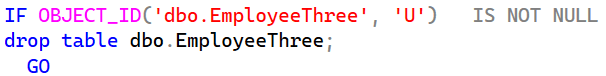
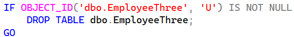

[marketplace]: https://marketplace.visualstudio.com/items?itemName=MadsKristensen.SqlFormatter
[vsixgallery]: http://vsixgallery.com/extension/SqlFormatter.fdf96f87-bc61-43ec-bc52-50fd011fd54f/
[repo]:https://github.com/madskristensen/SqlFormatter

# SQL Formatter for Visual Studio

[](https://github.com/madskristensen/SqlFormatter/actions/workflows/build.yaml)

Download this extension from the [Visual Studio Marketplace][marketplace]
or get the [CI build][vsixgallery]

----------------------------------------

Formats T-SQL code to a consistent and readable layout.

Invoke the *Format Document* command or `CTRL+K, CTRL+D` to format the document using the settings specified in the options. If no settings has been modified, the default settings will be used.

**Before:**



**After:**



## .editorconfig support
You can specify the configuration options in an `.editorconfig` file. Here's an example:

```ini
[*.sql]
keyword_standardization = true
spaces_per_tab = 4
expand_comma_lists = true
trailing_commas = true
space_after_expanded_comma = true
uppercase_keywords = false
break_join_on_sections = false
expand_boolean_expressions = true
expand_between_conditions = false
expand_case_statements = true
expand_in_lists = true
max_line_width = 999
indent_string = "   "
new_clause_line_breaks = true
new_statement_line_breaks = true
```

When there are no .editorconfig files or the `[*.sql]` section is missing, the global options will be used.

## Global options


## How can I help?
If you enjoy using the extension, please give it a ★★★★★ rating on the [Visual Studio Marketplace][marketplace].

Should you encounter bugs or if you have feature requests, head on over to the [GitHub repo][repo] to open an issue if one doesn't already exist.

Pull requests are also very welcome, since I can't always get around to fixing all bugs myself. This is a personal passion project, so my time is limited.

Another way to help out is to [sponsor me on GitHub](https://github.com/sponsors/madskristensen).
