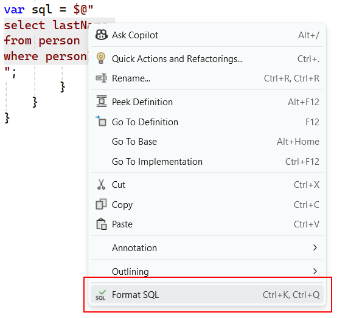
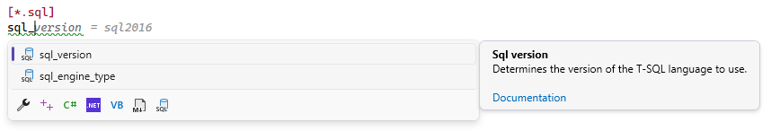
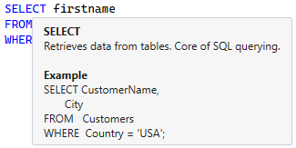

[marketplace]: <https://marketplace.visualstudio.com/items?itemName=MadsKristensen.SqlFormatter>
[vsixgallery]: <http://vsixgallery.com/extension/SqlFormatter.fdf96f87-bc61-43ec-bc52-50fd011fd54f/>
[repo]:<https://github.com/madskristensen/SqlFormatter>

# SQL Formatter for Visual Studio

[](https://github.com/madskristensen/SqlFormatter/actions/workflows/build.yaml)


Download this extension from the [Visual Studio Marketplace][marketplace]
or get the [CI build][vsixgallery]

----------------------------------------

## Features

- Formats T-SQL code to a consistent and readable layout
- Customizable formatting rules
- .editorconfig support
- Provides hover tooltips on SQL keywords with example usage
- Format on save (off by default. Enable in global options)
- Integrates with the [EditorConfig Language Service extension](https://marketplace.visualstudio.com/items?itemName=MadsKristensen.EditorConfig)

Invoke the *Format Document* command or `CTRL + K + Q` to format the document using the settings specified in the options. If no settings has been modified, the default settings will be used.

*Powered by the [SqlScriptDOM by Microsoft](https://github.com/microsoft/SqlScriptDOM)*.

**Before:**

```sql
SELECT p.Name as ProductName,
    NonDiscountSales = (OrderQty * UnitPrice),
    Discounts = ((OrderQty * UnitPrice) * UnitPriceDiscount)
FROM Production.Product AS p
inner join Sales.SalesOrderDetail As sod On p.ProductID = sod.ProductID
ORDER BY ProductName desc;
```

**After:**

```sql
SELECT   p.Name AS ProductName,
         (OrderQty * UnitPrice) AS NonDiscountSales,
         ((OrderQty * UnitPrice) * UnitPriceDiscount) AS Discounts
FROM     Production.Product AS p
         INNER JOIN
         Sales.SalesOrderDetail AS sod
         ON p.ProductID = sod.ProductID
ORDER BY ProductName DESC;
```

## Format strings

In C# and other languages, you can invoke the formatter by selecting the text and right-click to select **Format SQL**. Or you can simply hit `Ctrl+K, Ctrl+Q`.



## .editorconfig support

You can specify the configuration options in an `.editorconfig` file. Here's an example:

```ini
[*.sql]
align_clause_bodies                                 = true
align_column_definition_fields                      = true
align_set_clause_item                               = true
allow_external_language_paths                       = true
allow_external_library_paths                        = true
as_keyword_on_own_line                              = true
include_semicolons                                  = false
indent_set_clause                                   = false
keyword_casing                                      = uppercase|lowercase|pascalcase
indentation_size                                    = 4
indent_view_body                                    = false
multiline_insert_sources_list                       = true
multiline_insert_targets_list                       = true
multiline_select_elements_list                      = true
multiline_set_clause_items                          = true
multiline_view_columns_list                         = true
multiline_where_predicates_list                     = true
new_line_before_close_parenthesis_in_multiline_list = true
new_line_before_from_clause                         = true
new_line_before_group_by_clause                     = true
new_line_before_having_clause                       = true
new_line_before_join_clause                         = true
new_line_before_offset_clause                       = true
new_line_before_open_parenthesis_in_multiline_list  = false
new_line_before_order_by_clause                     = true
new_line_before_output_clause                       = true
new_line_before_where_clause                        = true
new_line_before_window_clause                       = true
newline_formatted_check_constraint                  = false
new_line_formatted_index_definition                 = false
num_newlines_after_statement                        = 1
space_between_data_type_and_parameters              = true
space_between_parameters_in_data_type               = true
sql_engine_type                                     = all|sqlazure|standalone
sql_version                                         = sql80|sql90|sql100|sql110|sql120|sql130|sql140|sql150|sql160|sql170
```

When there are no .editorconfig files or the `[*.sql]` section is missing, the global options will be used.

When using the [EditorConfig Language Service](https://marketplace.visualstudio.com/items?itemName=MadsKristensen.EditorConfig) extension, the properties will be picked up automatically to provide IntelliSense and validation support.



## Global options


## Keyword tooltips

Hover the mouse cursor over any keyword or built in function and a tooltip appears. It contains a full description and examples formatted to your settings.



## How can I help?

If you enjoy using the extension, please give it a ★★★★★ rating on the [Visual Studio Marketplace][marketplace].

Should you encounter bugs or if you have feature requests, head on over to the [GitHub repo][repo] to open an issue if one doesn't already exist.

Pull requests are also very welcome, since I can't always get around to fixing all bugs myself. This is a personal passion project, so my time is limited.

Another way to help out is to [sponsor me on GitHub](https://github.com/sponsors/madskristensen).
